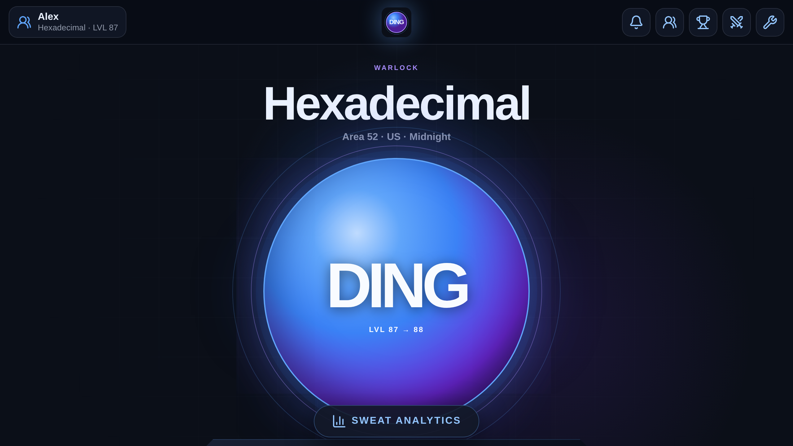
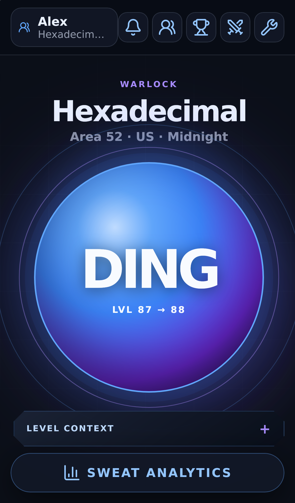
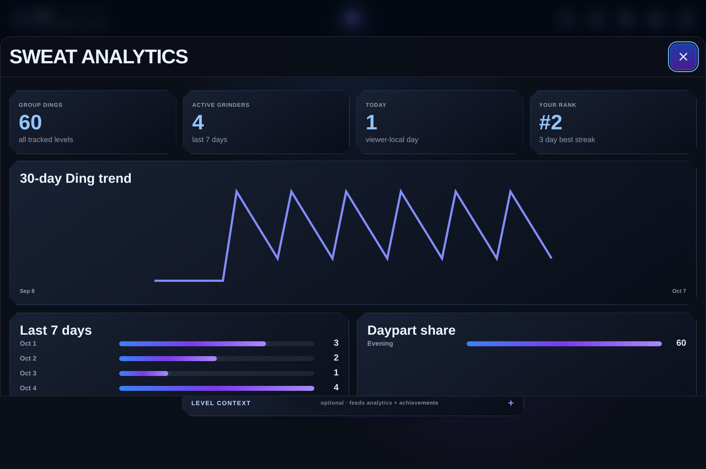
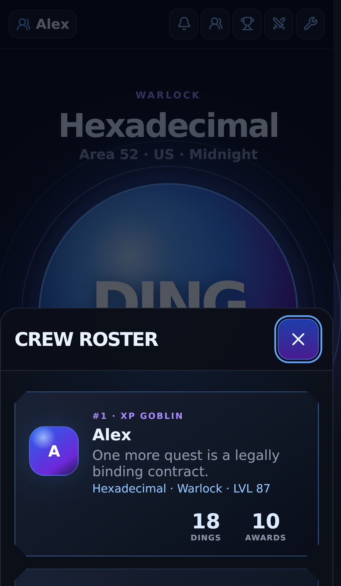

# DING

A mobile-first social World of Warcraft leveling tracker for a private crew. DING turns each character level into a server-authoritative social event with realtime crew activity, achievements, app-XP progression, analytics, push notifications, Discord mirroring, PWA install support, and deliberately sweaty-gamer humor.

DING was derived from the mature architecture of `A13Xg/Bust-Webapp`, but it is an independent application with its own domain model, Supabase project, storage namespace, PWA identity, notification tags, credentials, and deployment target.

## Screenshots

These screenshots are rendered automatically from the real React application with deterministic demo data. Production never enables demo mode.

| Dashboard | Mobile |
| --- | --- |
|  |  |

| Analytics | Crew |
| --- | --- |
|  |  |

The `Update DING screenshots` GitHub Action refreshes these images when UI source changes.

## What is implemented

- **Atomic Dings:** a character advances exactly one level through the `record_ding` Postgres RPC. The server locks the character row, verifies ownership/current level/cap, timestamps the event, and updates the character atomically.
- **Safe retries:** each Ding uses a client UUID. Uncertain network results are checked by event ID and retried with the same UUID instead of creating ambiguous duplicate progression.
- **Characters:** multiple characters per account, active-character selection, editable metadata, archive state, class/spec/race/faction/realm/region, configurable level cap.
- **Realtime crew:** shared Ding feed, remote Ding/achievement toasts, player profiles, alt rosters, showcases, recent activity, and achievement comparisons.
- **Progression:** DING app-XP/ranks are separate from actual WoW character levels.
- **Achievements:** production-scale DING catalog with milestone, pace, streak, time-of-day, activity, zone, alt/class, notes, deaths, max-level, calendar, and synchronized crew-award families.
- **Analytics:** group activity, 30-day trend, weekly volume, daypart/hour views, weekday×hour heatmap, character contribution, measured leveling pace, app-XP ranking, and persisted-data-only records.
- **Push:** service-worker Web Push, per-device acknowledgements, stale/ghost endpoint recovery, exactly-once event ledger, backstop dispatch, targeted/admin test sends, and one achievement push per reconciliation burst.
- **Discord:** admin-configurable webhook templates, DING-specific tokens, independent dedupe ledger, preview/test sends, and secret-safe webhook handling.
- **Inactivity:** configured re-engagement cadence with deterministic weighted DING messages and scheduled dispatch.
- **PWA:** standalone install flow, iOS guidance, generated icon family, stale-build detection/reload, safe-area mobile drawers, centered achievement cards, haptics, and reduced-motion handling.
- **Operations console:** build/service-worker diagnostics, delivery log, push testing, account admin, Discord settings/testing, and a local-only progression sandbox.
- **Release automation:** CI, deterministic screenshots, credential-gated Supabase deployment, live concurrency/RLS smoke test, GitHub Pages deployment, push backstop schedule, and inactivity schedule.
- **Optional integrations:** manual characters are fully functional. Battle.net is isolated behind a provider-neutral adapter and is not required for v1.

See `ROADMAP.md` for the execution ledger and `PROJECT.md` for architectural invariants.

## Stack

- React 19 + Vite
- Framer Motion + Lucide
- Supabase Auth / Postgres / RLS / Realtime
- Supabase Edge Functions (Deno)
- Web Push / Service Worker / VAPID
- GitHub Pages + GitHub Actions
- Vitest + ESLint + Prettier + TypeScript checks

## Local development

```bash
npm ci
cp .env.example .env.local
npm run dev
```

For a real backend, populate:

```dotenv
VITE_SUPABASE_URL=
VITE_SUPABASE_ANON_KEY=
VITE_WEB_PUSH_PUBLIC_KEY=
```

The app can build without a live backend. Authenticated runtime flows require a dedicated DING Supabase project.

### Deterministic visual/demo mode

The screenshot workflow uses:

```bash
VITE_DEMO_MODE=true npm run dev
```

This substitutes deterministic local demo data at the backend adapter boundary. It is intentionally **not** set in the production deployment workflow.

Available screenshot panels include:

```text
/?panel=analytics
/?panel=crew
/?panel=trophy
/?panel=profile
/?panel=feed
/?panel=characters
/?panel=ops
```

## Production setup

DING must use a dedicated Supabase project. Never reuse Bust production values.

### Required GitHub secrets

| Secret | Purpose |
| --- | --- |
| `SUPABASE_ACCESS_TOKEN` | Supabase CLI deployment |
| `SUPABASE_DB_PASSWORD` | Link/apply migrations |
| `SUPABASE_PROJECT_REF` | Dedicated DING project |
| `VITE_SUPABASE_URL` | Browser Supabase URL |
| `VITE_SUPABASE_ANON_KEY` | Browser anon key |
| `VITE_WEB_PUSH_PUBLIC_KEY` | Browser VAPID public key |
| `VAPID_PUBLIC_KEY` | Edge Function push signing |
| `VAPID_PRIVATE_KEY` | Edge Function push signing |
| `VAPID_SUBJECT` | VAPID contact subject |
| `REMINDER_CRON_SECRET` | Scheduled backstop/reminder authentication |
| `DING_INVITE_CODE` | Private 24+ character server-side crew signup secret |

Optional:

| Secret | Purpose |
| --- | --- |
| `BROADCAST_ADMINS` | SHA-256 allowlist for privileged admin functions; if absent, all admin endpoints deny access |
| `DISCORD_WEBHOOK_URL` | Default Discord webhook if not stored through admin settings |

Generate a VAPID pair with:

```bash
npm run generate:vapid
```

`BROADCAST_ADMINS` is optional only if you intentionally want the privileged Ops controls disabled. There is no baked-in fallback administrator.

Generate an admin allowlist digest with:

```bash
node -e "console.log(require('crypto').createHash('sha256').update('YOUR_USERNAME'.toLowerCase()).digest('hex'))"
```

### Signup model

DING signup is handled by the unauthenticated-but-invite-gated `signup-account` Edge Function. The invite code never ships in the browser bundle. The function uses the service role to create a **confirmed** synthetic-email auth user plus its clean profile, then the browser signs in with the new credentials.

Use a random `DING_INVITE_CODE` of at least 24 characters. Because users are server-created as confirmed accounts, no Supabase email-confirmation setting change is required.

## Deployment

The `Deploy DING` workflow is intentionally manual and credential-gated. Once the secrets above exist, it performs the release chain in this order:

1. install dependencies;
2. validate required secrets;
3. link the dedicated Supabase project;
4. apply DING migrations;
5. configure Edge Function secrets;
6. deploy all DING Edge Functions;
7. run the live integration/concurrency smoke test;
8. build with the DING GitHub Pages base path;
9. deploy the Pages artifact.

The live smoke test creates **two** temporary invite-gated accounts and characters, validates cross-account RLS/ownership, forbidden direct writes, Realtime propagation, UUID idempotency, competing concurrent Dings, note ownership, synchronized crew achievements, validated profile showcases, and admin fail-closed behavior, then deletes both accounts.

After deployment, `DING Scheduled Maintenance` runs:
- push backstop every 15 minutes;
- inactivity reminder dispatch every 6 hours.

Those jobs remain harmless/dormant until their required secrets exist.

## Core invariants

### Atomic progression

The browser does **not** write `level_events` directly. `record_ding` must:

1. authenticate the actor;
2. lock the character row;
3. verify ownership and non-archived state;
4. enforce the configured level cap;
5. require the expected current level;
6. make the client event UUID idempotent;
7. prevent duplicate destination levels;
8. use the server timestamp;
9. insert the event and update `characters.current_level` atomically.

### Separate player and character progression

A WoW character level and a DING account rank are separate concepts. Achievement points drive DING app-XP; they never mutate the character's game level.

### Notification reliability

Dings and achievements persist independently of announcements. Push/Discord failures cannot turn a committed Ding into a failed save. Backstops retry unannounced rows while dedupe ledgers prevent normal duplicate delivery.

## Repository layout

```text
src/                         React app, DING domain, analytics and tests
public/                      DING PWA assets and service worker
supabase/migrations/         deployable DING-only schema
supabase/functions/          DING Edge Functions
supabase/legacy_bust_migrations/
                             non-deployable historical reference only
scripts/supabase-smoke.mjs   live backend/concurrency verification
.github/workflows/           CI, screenshots, deploy and scheduled jobs
docs/screenshots/            generated real-app screenshots
```

## Safety boundaries

- Never point this repository at the Bust production Supabase project.
- Never put service-role, VAPID private, webhook, DB-password, or cron secrets in `VITE_*` variables.
- Legacy Bust migrations are reference-only and live outside `supabase/migrations/`.
- Admin password reset, arbitrary broadcast, delivery logs, and Discord configuration are server-side allowlisted.
- Demo mode is for visual/test builds only and is not enabled by production workflows.

## Remaining release gate

Repository-only implementation is intended to be complete before backend linkage. The remaining release gate is expected to be:

1. create/link the dedicated DING Supabase project;
2. add the required GitHub secrets;
3. run `Deploy DING`;
4. let the automated two-account live smoke pass;
5. verify installed iOS/Android PWA push behavior and final physical-device layout.

Any failures found by those live/device checks should be fixed before calling the deployment production-ready.
